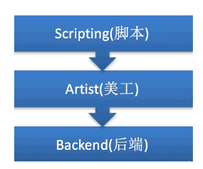
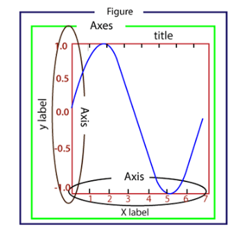
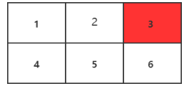
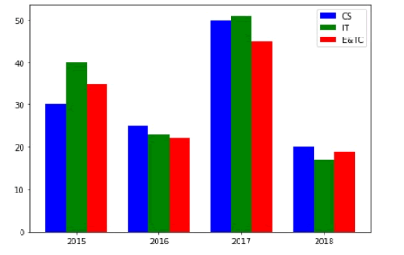
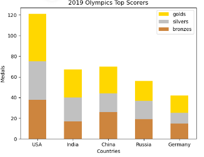
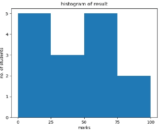
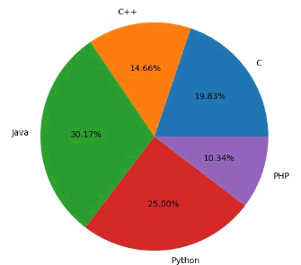

# Python Matplotlib 简易使用

[Matplotlib 中文官网](https://matplotlib.net/stable/gallery/mplot3d/index.html)

[Matplotlib 详细教程](https://blog.csdn.net/sinat_41942180/article/details/134036932)

## 1. Matplotlib 安装和导入

`Matplotlib` 是一个强大的 Python 绘图库，用于创建各种类型的静态、动态和交互式图表。

使用以下指令安装 `Matplotlib`：

```shell
$ pip install matplotlib
```

导入 `Matplotlib` 包：

```python
import matplotlib
```

`Pyplot` 是 `Matplotlib` 的子库，提供了和 MATLAB 类似的绘图 API。`Pyplot` 是常用的绘图模块，能很方便让用户绘制 2D 图表。

使用时，通常命名为 `plt`。

```python
import matplotlib.pyplot as plt
```

## 2. Matplotlib 架构和图形

- Matplotlib 由三个不同的层次结构组成，分别是脚本层、美工层和后端层。



> - 脚本层是 Matplotlib 结构中的最顶层。编写的绘图代码大部分代码都在该层运行，它的主要工作是负责生成图形与坐标系。
> - 美工层是结构中的第二层，它提供了绘制图形的元素时的给各种功能，例如绘制标题、轴标签、坐标刻度等。
> - 后端层是 Matplotlib 最底层，它定义了三个基本类，首先是 `FigureCanvas`（图层画布类），它提供了绘图所需的画布，其次是 `Renderer`（绘图操作类），它提供了在画布上进行绘图的各种方法，最后是 `Event`（事件处理类），它提供了用来处理鼠标和键盘事件的方法。

- Matplotlib 的图像构成



> - `Figure`：指整个图形，您可以把它理解成一张画布，它包括了所有的元素，比如标题、轴线等；
> -  `Axes`：绘制 2D 图像的实际区域，也称为轴域区，或者绘图区；
> -  `Axis`：指坐标系中的垂直轴与水平轴，包含轴的长度大小、轴标签（指 x 轴，y轴）和刻度标签；
> - `Artist`：在画布上看到的所有元素都属于 `Artist` 对象，比如文本对象（`title`、`xlabel`、`ylabel`）、`Line2D` 对象（用于绘制2D图像）等。

## 3. Matplotlib 基本绘图

```python
import matplotlib.pyplot as plt
import numpy as np
import math

# 创建一组 0 —— 2pi 之内的三角函数数据
x = np.arange(0, math.pi*2, 0.05)
y = np.sin(x)

# 使用 plot() 函数绘制图像
plt.plot(x,y)

# 补充坐标轴标签，图像标题
plt.xlabel("angle")
plt.ylabel("sine")
plt.title("sine wave")

# 使用 show() 显示图像
plt.show()
```

- `plot()` 函数用于画图，可以绘制点和线，语法格式如下：

```python
"""
	x, y：    点或线的节点，x 为 x 轴数据，y 为 y 轴数据，数据可以列表或数组。
	fmt：     可选，定义基本格式（如颜色、标记和线条样式）。
	**kwargs：可选，用在二维平面图上，设置指定属性，如标签，线的宽度等。
"""

# 画单条线
plot([x], y, [fmt], *, data=None, **kwargs)
# 画多条线
plot([x], y, [fmt], [x2], y2, [fmt2], ..., **kwargs)
```

> 1. **颜色字符：**`'b'` 蓝色，`'m'` 洋红色，`'g'` 绿色，`'y'` 黄色，`'r'` 红色，`'k'` 黑色，`'w'` 白色，`'c'` 青绿色，`'#008000'` RGB 颜色符串。多条曲线不指定颜色时，会自动选择不同颜色。
> 2. **线型参数：**`'‐'` 实线，`'‐‐'` 破折线，`'‐.'` 点划线，`':'` 虚线。
> 3. **标记字符：**`'.'` 点标记，`','` 像素标记(极小点)，`'o'` 实心圈标记，`'v'` 倒三角标记，`'^'` 上三角标记，`'>'` 右三角标记，`'<'` 左三角标记...

> **自定义标记**：可以使用 `plot()` 函数的 `marker` 参数来定义。
>
> | 标记                 | 符号                                          | 描述                                         |
> | :------------------- | :-------------------------------------------- | :------------------------------------------- |
> | `"."`                |  | 点                                           |
> | `","`                |  | 像素点                                       |
> | `"o"`                |  | 实心圆                                       |
> | `"v"`                |  | 下三角                                       |
> | `"^"`                |  | 上三角                                       |
> | `"<"`                |  | 左三角                                       |
> | `">"`                |  | 右三角                                       |
> | `"1"`                |  | 下三叉                                       |
> | `"2"`                |  | 上三叉                                       |
> | `"3"`                |  | 左三叉                                       |
> | `"4"`                |  | 右三叉                                       |
> | `"8"`                |  | 八角形                                       |
> | `"s"`                |  | 正方形                                       |
> | `"p"`                |  | 五边形                                       |
> | `"P"`                |  | 加号（填充）                                 |
> | `"*"`                |  | 星号                                         |
> | `"h"`                |  | 六边形 1                                     |
> | `"H"`                |  | 六边形 2                                     |
> | `"+"`                |  | 加号                                         |
> | `"x"`                |  | 乘号 x                                       |
> | `"X"`                |  | 乘号 x (填充)                                |
> | `"D"`                |  | 菱形                                         |
> | `"d"`                |  | 瘦菱形                                       |
> | `"|"`                |  | 竖线                                         |
> | `"_"`                |  | 横线                                         |
> | `0 (TICKLEFT)`       |  | 左横线                                       |
> | `1 (TICKRIGHT)`      |  | 右横线                                       |
> | `2 (TICKUP)`         |  | 上竖线                                       |
> | `3 (TICKDOWN)`       |  | 下竖线                                       |
> | `4 (CARETLEFT)`      |  | 左箭头                                       |
> | `5 (CARETRIGHT)`     |  | 右箭头                                       |
> | `6 (CARETUP)`        |  | 上箭头                                       |
> | `7 (CARETDOWN)`      |  | 下箭头                                       |
> | `8 (CARETLEFTBASE)`  |  | 左箭头 (中间点为基准)                        |
> | `9 (CARETRIGHTBASE)` |  | 右箭头 (中间点为基准)                        |
> | `10 (CARETUPBASE)`   |  | 上箭头 (中间点为基准)                        |
> | `11 (CARETDOWNBASE)` |  | 下箭头 (中间点为基准)                        |
> | `"None", " " or ""`  |                                               | 没有任何标记                                 |
> | `'$...$'`            |  | 渲染指定的字符。例如 "$f$" 以字母 f 为标记。 |

> **自定义线型**：线的类型可以使用 `linestyle` 参数来定义。
>
> | 类型        | 简写          | 说明   |
> | :---------- | :------------ | :----- |
> | `'solid' `  | `'-'`         | 实线   |
> | `'dotted'`  | `':'`         | 点虚线 |
> | `'dashed'`  | `'--'`        | 破折线 |
> | `'dashdot'` | `'-.'`        | 点划线 |
> | `'None'`    | `''` 或 `' '` | 不画线 |

> **自定义线宽**：线的宽度可以使用 `linewidth` 参数来定义，值可以是浮点数。

-  `xlabel()` 和 `ylabel()` 函数设置 x 轴和 y 轴的标签。
-  `title()` 函数设置标题。
-  `grid()` 函数设置图表中的网格线。

```python
"""
	b：可选，默认为 None，可以设置布尔值，true 为显示网格线，false 为不显示，如果设置 **kwargs 参数，则值为 true。
	which：可选，可选值有 'major'、'minor' 和 'both'，默认为 'major'，表示应用更改的网格线。
	axis：可选，设置显示哪个方向的网格线，可以是取 'both'（默认），'x' 或 'y'，分别表示两个方向，x 轴方向或 y 轴方向。
	**kwargs：可选，设置网格样式，可以是 color='r', linestyle='-' 和 linewidth=2，分别表示网格线的颜色，样式和宽度。
"""
matplotlib.pyplot.grid(b=None, which='major', axis='both', )
```

- `xscale`或`yscale`属性可实现对坐标轴的格式设置。

```python
x = np.arange(1,20)

fig, ax = plt.subplots()

ax.plot(x,np.exp(x))
ax.plot(x,x**2)

# y轴设置为对数坐标
ax.set_yscale("log")

ax.set_title("Logarithmic scale (y)")

ax.set_xlabel("x axis")
ax.set_ylabel("y axis")
```

> 轴是连接刻度的线，也就是绘图区域的边界，在绘图区域（`axes` 对象）的顶部、底部、左侧和右侧都有一个边界线（轴）。通过指定轴的颜色和宽度，从而对进行显示格式设置，比如将所有轴的颜色设置为 `None`，那么它们都会成为隐藏状态，或者也可以给轴添加相应的颜色。
>
> ```python
> fig = plt.figure()
> ax = fig.add_axes([0,0,1,1])
> # 为左侧轴，底部轴添加颜色
> ax.spines['bottom'].set_color('blue')
> ax.spines['left'].set_color('red')
> ax.spines['left'].set_linewidth(2)
> # 将侧轴、顶部轴设置为None
> ax.spines['right'].set_color(None)
> ax.spines['top'].set_color(None)
> ax.plot([1,2,3,4,5])
> plt.show()
> ```

- Matplotlib 可以根据自变量与因变量的取值范围，自动设置 x 轴与 y 轴的数值大小。也可以用自定义的方式，通过 `set_xlim()` 和 `set_ylim()` 对 x、y 轴的数值范围进行设置。

```python
fig = plt.figure()
ax = fig.add_axes([0,0,1,1])

x = np.arange(1,10)
ax.plot(x, np.exp(x),'r')
ax.set_title('exp')
# 设置y轴
ax.set_ylim(0,10000)
# 设置x轴
ax.set_xlim(0,10)
plt.show()
```

- 刻度指的是轴上数据点的标记，Matplotlib 能够自动的在 x 、y 轴上绘制出刻度。这一功能的实现得益于 Matplotlib 内置的刻度定位器和格式化器（两个内建类）。在大多数情况下，这两个内建类完全能够满足我们的绘图需求，但是在某些情况下，刻度标签或刻度也需要满足特定的要求，比如将刻度设置为英文数字形式或者大写阿拉伯数字，此时就需要对它们重新设置。`xticks()` 和 `yticks()` 函数接受一个列表对象作为参数，列表中的元素表示对应数轴上要显示的刻度。也可以分别通过 `set_xticklabels()` 和 `set_yticklabels()` 函数设置与刻度线相对应的刻度标签。
- 当不对 Matplotlib 进行设置，而直接使用中文时，绘制的图像会出现中文乱码。通过临时重写配置文件的方法，可以解决 Matplotlib 显示中文乱码的问题。

```python
plt.rcParams["font.sans-serif"]=["SimHei"] #设置字体
plt.rcParams["axes.unicode_minus"]=False   #该语句解决图像中的“-”负号的乱码问题
```

## 4. Matplotlib 多图绘制

<font color=LightGreen>1.  `subplot()` 函数</font>

```python
"""
	nrows,ncols: 表示要划分几行几列的子区域（nrows*nclos表示子图数量）
	index:		 初始值为1，用来选定具体的某个子区域。
"""
plt.subplot(nrows, ncols, index)
```

> `subplot(233)` 表示在当前画布的右上角创建一个两行三列的绘图区域（如下图所示），同时，选择在第 3 个位置绘制子图。
>
> 

如果新建的子图与现有的子图重叠，那么重叠部分的子图将会被自动删除，因为它们不可以共享绘图区域。

如果不想覆盖之前的图，需要使用 `add_subplot()` 函数。

```python
fig = plt.figure()
ax1 = fig.add_subplot(111)
ax1.plot([1,2,3])
ax2 = fig.add_subplot(221, facecolor='y')
ax2.plot([1,2,3])
```

<font color=LightGreen>2.  `subplots()` 函数</font>

`subplots()` 既创建了一个包含子图区域的画布，又创建了一个 `figure` 图形对象，而 `subplot()` 只是创建一个包含子图区域的画布。

```python
"""
	nrows, ncols: 表示两个整数参数，它们指定子图所占的行数、列数。

	函数的返回值是一个元组，包括一个图形对象和所有的 axes 对象。其中 axes 对象的数量等于 nrows * ncols，且每个 axes 对象均可通过索引值访问（从1开始）。
"""
fig, ax = plt.subplots(nrows, ncols)
```

```python
fig,a = plt.subplots(2,2)
x = np.arange(1,10)

#绘制平方函数
a[0][0].plot(x,x*x)
a[0][0].set_title('square')
#绘制平方根图像
a[0][1].plot(x,np.sqrt(x))
a[0][1].set_title('square root')
#绘制指数函数
a[1][0].plot(x,np.exp(x))
a[1][0].set_title('exp')
#绘制对数函数
a[1][1].plot(x,np.log10(x))
a[1][1].set_title('log')

plt.show()
```

<font color=LightGreen>3. `subplot2grid()`函数</font>

`subplot2grid()`函数能够在画布的特定位置创建 `axes` 对象（即绘图区域）。不仅如此，它还可以使用不同数量的行、列来创建跨度不同的绘图区域。与 `subplot()` 和 `subplots()` 函数不同，`subplot2gird()` 函数以非等分的形式对画布进行切分，并按照绘图区域的大小来展示最终绘图结果。

```python
"""
	shape：把该参数值规定的网格区域作为绘图区域；
	location：在给定的位置绘制图形，初始位置 (0,0) 表示第1行第1列；
	rowsapan/colspan：这两个参数用来设置让子区跨越几行几列。
"""
plt.subplot2grid(shape, location, rowspan, colspan)
```

```python
a1 = plt.subplot2grid((3,3),(0,0),colspan = 2)
a2 = plt.subplot2grid((3,3),(0,2), rowspan = 3)
a3 = plt.subplot2grid((3,3),(1,0),rowspan = 2, colspan = 2)

x = np.arange(1,10)
a2.plot(x, x*x)
a2.set_title('square')

a1.plot(x, np.exp(x))
a1.set_title('exp')

a3.plot(x, np.log(x))
a3.set_title('log')
```

## 5. Matplotlib 2D图绘制

### 双轴图

有时需要绘制两个 x 轴或两个 y 轴，这样可以更直观地显现图像，从而获取更有效的数据。Matplotlib 提供的 `twinx()` 和 `twiny()` 函数，除了可以实现绘制双轴的功能外，还可以使用不同的单位来绘制曲线，比如一个轴绘制对函数，另外一个轴绘制指数函数。

```python
# 创建图形对象
fig = plt.figure()
# 添加子图区域
a1 = fig.add_axes([0,0,1,1])
# 准备数据
x = np.arange(1,20)
# 绘制指数函数
a1.plot(x,np.exp(x))
a1.set_ylabel('exp')

# 添加双轴
a2 = a1.twinx()
a2.plot(x, np.log(x),'r-')
# 绘制对数函数
a2.set_ylabel('log')
# 绘制图例
fig.legend(labels = ('exp','log'),loc='upper left')
plt.show()
```

### 柱状图

```python
"""
	x:一个标量序列，代表柱状图的x坐标，默认x取值是每个柱状图所在的中点位置，或者也可以是柱状图左侧边缘位置。
	height:一个标量或者是标量序列，代表柱状图的高度。
	width:可选参数，标量或类数组，柱状图的默认宽度值为 0.8。
	bottom:可选参数，标量或类数组，柱状图的y坐标默认为None。
	algin:有两个可选项 {"center","edge"}，默认为 'center'，该参数决定 x 值位于柱状图的位置。
"""
ax.bar(x, height, width, bottom, align)
```

> 1. 通过调整柱状图的宽度，可以实现在同一 x 轴位置绘制多个柱状图。
> 1. 可以将它们设置成不同的颜色，从而使它们更容易区分。
>
> ```python
> # 准备数据
> data =[[30, 25, 50, 20],[40, 23, 51, 17],[35, 22, 45, 19]]
> X = np.arange(4)
> fig = plt.figure()
> # 添加子图区域
> ax = fig.add_axes([0,0,1,1])
> # 绘制柱状图
> ax.bar(X + 0.00, data[0], color = 'b', width = 0.25)
> ax.bar(X + 0.25, data[1], color = 'g', width = 0.25)
> ax.bar(X + 0.50, data[2], color = 'r', width = 0.25)
> plt.show()
> ```
>
> 
>
>
> 3. 垂直方向的柱形图可以使用 `barh()` 方法来设置。
> 4. 柱状图除了上述使用方法外，还有另外一种堆叠柱状图。所谓堆叠柱状图就是将不同数组别的柱状图堆叠在一起，堆叠后的柱状图高度显示了两者相加的结果值。`bar() `函数提供了一个可选参数bottom，该参数可以指定柱状图开始堆叠的起始值，一般从底部柱状图的最大值开始，依次类推。
>
> ```python
> """
>     第一次调用plt.bar()绘制了黄色柱状图， 第二次调用plot.bar()时绘制了灰色柱状图,最后一次调用plt.bar()则绘制最底部的柱状图。
>     两个柱状图相接触的位置就是顶部与底部的位置，这样就构成了柱状堆叠图。
> """
> countries = ['USA', 'India', 'China', 'Russia', 'Germany']
> bronzes = np.array([38, 17, 26, 19, 15])
> silvers = np.array([37, 23, 18, 18, 10])
> golds = np.array([46, 27, 26, 19, 17])
> # 此处的 _ 下划线表示将循环取到的值放弃，只得到[0,1,2,3,4]
> ind = [x for x, _ in enumerate(countries)]
> # 绘制堆叠图
> plt.bar(ind, golds, width=0.5, label='golds', color='gold', bottom=silvers+bronzes)
> plt.bar(ind, silvers, width=0.5, label='silvers', color='silver', bottom=bronzes)
> plt.bar(ind, bronzes, width=0.5, label='bronzes', color='#CD853F')
> # 设置坐标轴
> plt.xticks(ind, countries)
> plt.ylabel("Medals")
> plt.xlabel("Countries")
> plt.legend(loc="upper right")
> plt.title("2019 Olympics Top Scorers")
> plt.show()
> ```
>
> 

### 直方图

```python
"""
	x: 必填参数，数组或者数组序列。
	bins: 可选参数，整数或者序列，bins 表示每一个间隔的边缘（起点和终点）默认会生成10个间隔。
	range: 指定全局间隔的下限与上限值 (min,max)，元组类型，默认值为 None。
	density: 如果为 True，返回概率密度直方图；默认为 False，返回相应区间元素的个数的直方图。
	histtype: 要绘制的直方图类型，默认值为“bar”，可选值有 barstacked(堆叠条形图)、step(未填充的阶梯图)、stepfilled(已填充的阶梯图)。
"""
plt.hist()
```

```python
# 创建图形对象和轴域对象
fig,ax = plt.subplots(1,1)
a = np.array([22,87,5,43,56,73,55,54,11,20,51,5,79,31,27])
# 绘制直方图
ax.hist(a, bins = [0,25,50,75,100])
# 设置坐标轴
ax.set_title("histogram of result")
ax.set_xticks([0,25,50,75,100])
ax.set_xlabel('marks')
ax.set_ylabel('no.of students')
plt.show()
```



### 饼状图

```python
"""
	x: 数组序列，数组元素对应扇形区域的数量大小。
	labels: 列表字符串序列，为每个扇形区域备注一个标签名字。
	color: 为每个扇形区域设置颜色，默认按照颜色周期自动设置。
	autopct: 格式化字符串"fmt%pct"，使用百分比的格式设置每个扇形区的标签，并将其放置在扇形区内。
"""
plt.pie()
```

```python
# 添加图形对象
fig = plt.figure()
ax = fig.add_axes([0,0,1,1])
# 使得X/Y轴的间距相等
ax.axis('equal')
# 准备数据
langs = ['C', 'C++', 'Java', 'Python', 'PHP']
students = [23,17,35,29,12]
# 绘制饼状图
ax.pie(students, labels = langs,autopct='%1.2f%%')
plt.show()
```



### 折线图

基本绘图能得到折线图。

### 散点图

基本绘图能得到散点图。

## 6. Matplotlib 3D图绘制

- 使用 `plot3D()` 函数能够得到 3D 图。

  ```python
  fig = plt.figure()
  # 创建3d绘图区域
  ax = plt.axes(projection='3d')
  # 从三个维度构建
  z = np.linspace(0, 1, 100)
  x = z * np.sin(20 * z)
  y = z * np.cos(20 * z)
  # 创建三维线图
  ax.plot3D(x, y, z, 'gray')
  ax.set_title('3D line plot')
  plt.show()
  ```

- 通过 `scatter3D()` 函数可以绘制 3D 散点图。

- 通过 `contour3D()` 可以用来创建三维等高线图，该函数要求输入数据均采用二维网格式的矩阵坐标。同时，它可以在每个网格点(x,y)处计算出一个 z 值。

  ```python
  def f(x, y):
      return np.sin(np.sqrt(x ** 2 + y ** 2))
  
  # 构建x、y数据
  x = np.linspace(-6, 6, 30)
  y = np.linspace(-6, 6, 30)
  # 将数据网格化处理
  X, Y = np.meshgrid(x, y)
  Z = f(X, Y)
  fig = plt.figure()
  ax = plt.axes(projection='3d')
  # 50表示在z轴方向等高线的高度层级
  ax.contour3D(X, Y, Z, 50)
  ax.set_xlabel('x')
  ax.set_ylabel('y')
  ax.set_zlabel('z')
  ax.set_title('3D contour')
  plt.show()
  ```

- 通过 `plot_wireframe()` 能够绘制 3D 线框图。

- 通过 `plot_surface()` 函数可以绘制 3D 曲面图。
