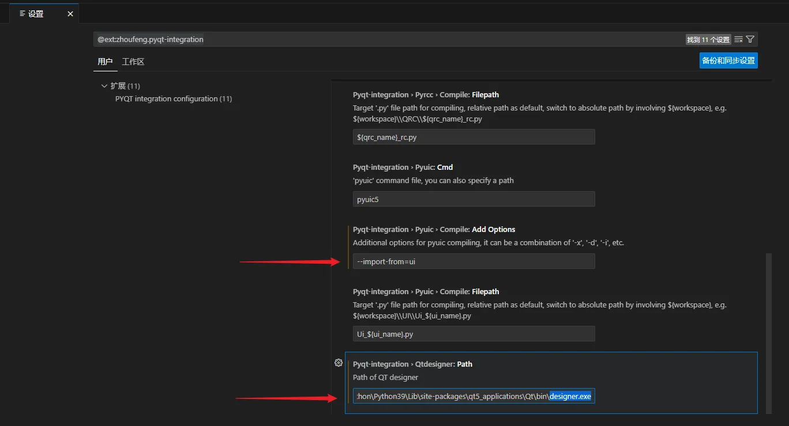
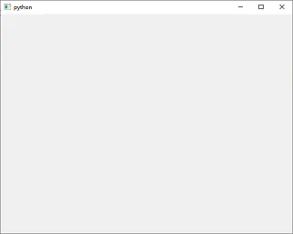

# Python PyQt5 1. PyQt5简介和环境创建

## 1. Qt 和 PyQt5 简介

Qt 是一个1991年由 Qt Company 开发的跨平台 C++ 图形用户界面开发框架。2008年，Qt Company 被诺基亚公司收购，Qt 也因此成为诺基亚旗下的编程语言工具。2012年，Qt 被 Digia 收购。2014年4月，跨平台集成开发环境 Qt Creator 3.1.0 正式发布。

Qt 原来使用 C++ 进行代码编写，为了在 Python 上更加方便的使用 Qt 进行上位机编程，可以使用 PyQt 库。

> - 基础高性能的Qt的图形界面控件集。
> - 能够跨平台运行在 Windows、Linux 和 Macos 等系统上。
> - 使用信号/槽(`signal`/`slot`)机制进行通信(其它语言采用回调方式)。
> - 对Qt库的完全封装。

- PyQt 和 PySide

如果不做商业项目，强烈建议使用 PyQt，资料多，稳定。全局替换成 PySide 也很方便。需要开发闭源商用软件的就用 PySide。所有 API 用起来几乎一样，PyQt5 的对应版本是PySide2。

## 2. PyQt5 环境创建

<font color=LightGreen>1. 环境创建</font>

```shell
$ pip install PyQt5
$ pip install PyQt5-tools 	# 安装Qt工具软件
$ pip install PyQt5-stubs   # 安装PyQt5语法检测包
```

<font color=LightGreen>2. VSCode 插件安装</font>

安装`PYQT Integration`插件，可以自动生成 UI 相关代码和资源。

1. 配置`.ui`生成的`.py`文件中导入资源的路径：`--import-from=ui` 指向ui目录
3. 在 Python 安装路径下找`designer.exe`，建议用everything搜索`designer.exe`。



<font color=LightGreen>3. 环境测试</font>

```python
from PyQt5.QtWidgets import QApplication,QWidget
import sys

# 1.创建应用程序
app = QApplication(sys.argv)

# 2.创建窗口
w = QWidget()

# 3.显示窗口
w.show()

# 4.等待窗口停止
sys.exit(app.exec())
```


